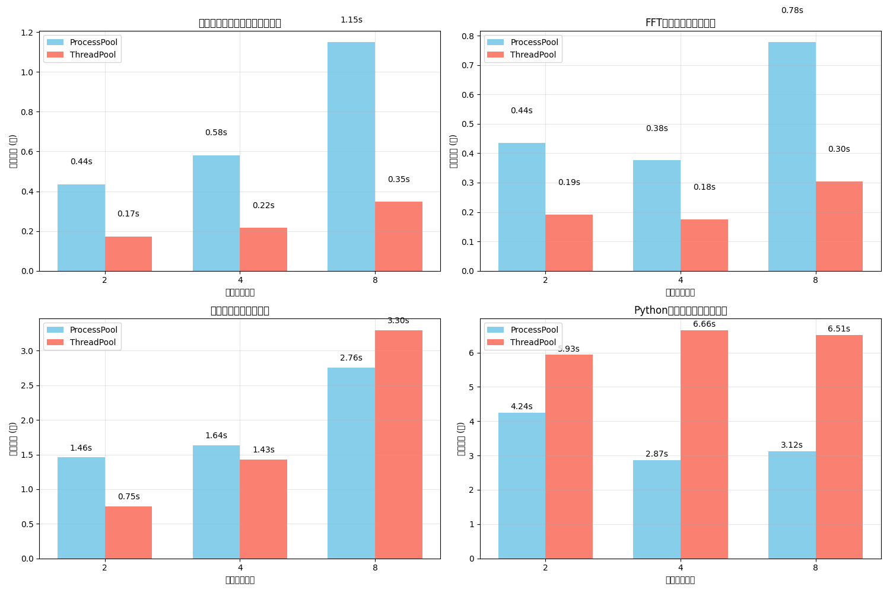
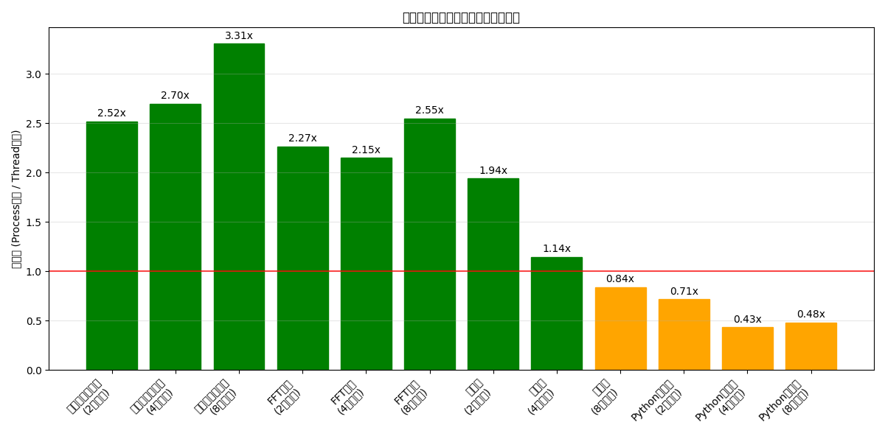

# Pythonの並列処理比較

本プロジェクトでは、Pythonの`ProcessPoolExecutor`と`ThreadPoolExecutor`を様々な計算負荷で比較し、性能差やGIL（Global Interpreter Lock）の影響を検証した。

## 検証結果のポイント

### GILの影響

タスクの特性によって最適な並列処理方式が異なる：

- **Pythonコード**：GILの制約を強く受け、`ProcessPoolExecutor`が顕著に優位（003_gilの検証結果）
- **NumPy最適化演算**：GILを解放する処理では`ThreadPoolExecutor`が最大7倍の性能向上
- **混合タスク**：NumPy処理の割合が増えるほど`ThreadPoolExecutor`の優位性が高まる

### メモリ効率

メモリ使用量の検証では次のような興味深い傾向が見られた：

- FFT変換での`ThreadPoolExecutor`のメモリ効率は圧倒的（185倍もの差）
- データ共有において`ThreadPoolExecutor`は低いオーバーヘッドを示す
- 特異値分解などの演算では`ProcessPoolExecutor`がメモリ効率で上回るケースも

### 演算タイプ別の傾向

演算の種類によって最適な選択肢は異なる：

- **行列積**：両エグゼキュータの性能差は小さい（1.07倍程度）
- **FFT変換**：`ThreadPoolExecutor`が2.36倍の速度優位
- **要素ごとの演算**：`ThreadPoolExecutor`が2.94倍の速度優位
- **Pythonループ**：`ProcessPoolExecutor`が約1.85倍の速度優位

## 主な実験結果

### 全体パフォーマンス比較

### メモリ効率の比較

### GIL影響分析

## 検証環境

検証は以下の環境で実施した：

- CPU: 22コア
- メモリ: 28.7 GB
- 複数のデータサイズと並列数の組み合わせ

## 主なベンチマーク

本プロジェクトでは、3種類のベンチマークを実施した：

### 1. 全体パフォーマンス比較 (001_overall)
2000x2000の行列に対し、2/4/8並列での各演算性能を検証

### 2. メモリ効率の詳細比較 (002_ram)
2000x2000の行列に対し、演算タイプ別のメモリ効率を分析

### 3. GILの影響検証 (003_gil)
1000x1000の行列を用い、様々なシナリオでGILの影響を検証

## 結論

1. **Pythonコード**ではGIL制約を回避するため`ProcessPoolExecutor`が適している
2. **NumPy/SciPyなどの最適化演算**ではメモリ効率・速度の両面で`ThreadPoolExecutor`が優位
3. **混合タスク**ではコード特性に応じた選択か、NumPy処理の割合を増やす工夫が有効

## 詳細レポート

各ベンチマークの詳細結果は以下のリンクから確認可能：

- [全体パフォーマンス比較](reports/001_overall/report_20250326_221913.md) - 処理時間とメモリ使用量の分析
- [メモリ効率の詳細比較](reports/002_ram/report_20250326_182433.md) - 演算タイプ別のメモリ効率
- [GILの影響検証](reports/003_gil/report_20250326_182638.md) - GIL制約下での最適並列戦略

すべてのグラフは `fig/` ディレクトリ内に保存されている。
