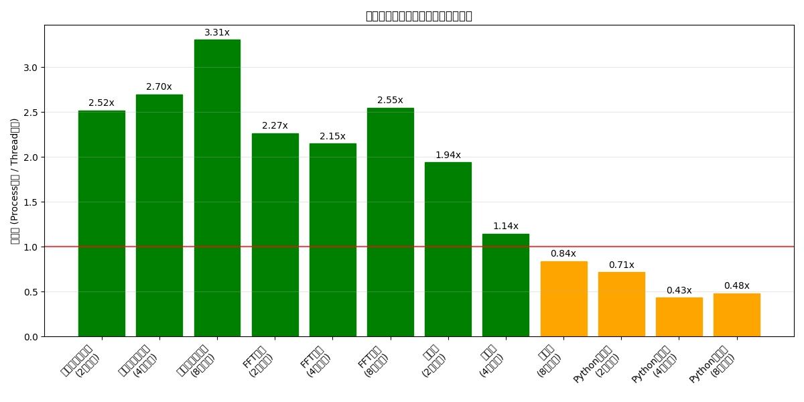
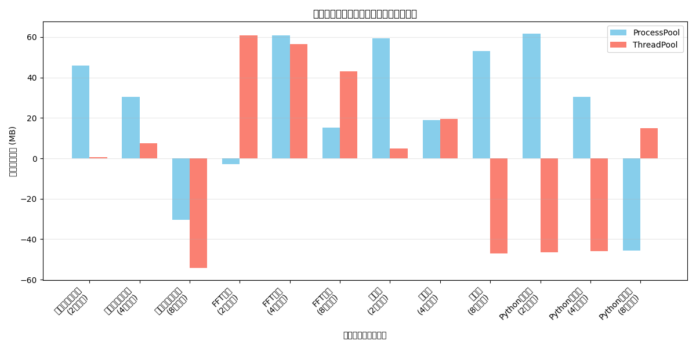

# NumPy並列処理ベンチマーク: ProcessPoolExecutor vs ThreadPoolExecutor

## 実行概要
- ベンチマーク ID: 001_overall
- 実行日時: 20250326_221912

## システム情報
- CPU: 22コア
- メモリ: 28.7 GB

## テスト設定
- データサイズ: 2000x2000 の行列
- 並列ジョブ数: 2, 4, 8
- 演算タイプ: 行列積, FFT変換, 要素ごとの演算, Pythonループ

## テスト結果

### 行列積

#### 並列ジョブ数: 2
- ProcessPoolExecutor 実行時間: 1.459秒
- ThreadPoolExecutor 実行時間: 0.752秒
- 速度比 (Process/Thread): 1.94x
- 結論: ThreadPoolExecutorが有利

**メモリ使用量:**
- ProcessPoolExecutor: 59.4 MB
- ThreadPoolExecutor: 4.8 MB

#### 並列ジョブ数: 4
- ProcessPoolExecutor 実行時間: 1.636秒
- ThreadPoolExecutor 実行時間: 1.431秒
- 速度比 (Process/Thread): 1.14x
- 結論: ThreadPoolExecutorが有利

**メモリ使用量:**
- ProcessPoolExecutor: 19.0 MB
- ThreadPoolExecutor: 19.6 MB

#### 並列ジョブ数: 8
- ProcessPoolExecutor 実行時間: 2.759秒
- ThreadPoolExecutor 実行時間: 3.299秒
- 速度比 (Process/Thread): 0.84x
- 結論: ProcessPoolExecutorが有利

**メモリ使用量:**
- ProcessPoolExecutor: 53.1 MB
- ThreadPoolExecutor: -46.9 MB

### FFT変換

#### 並列ジョブ数: 2
- ProcessPoolExecutor 実行時間: 0.435秒
- ThreadPoolExecutor 実行時間: 0.192秒
- 速度比 (Process/Thread): 2.27x
- 結論: ThreadPoolExecutorが有利

**メモリ使用量:**
- ProcessPoolExecutor: -2.9 MB
- ThreadPoolExecutor: 60.7 MB

#### 並列ジョブ数: 4
- ProcessPoolExecutor 実行時間: 0.376秒
- ThreadPoolExecutor 実行時間: 0.175秒
- 速度比 (Process/Thread): 2.15x
- 結論: ThreadPoolExecutorが有利

**メモリ使用量:**
- ProcessPoolExecutor: 60.9 MB
- ThreadPoolExecutor: 56.4 MB

#### 並列ジョブ数: 8
- ProcessPoolExecutor 実行時間: 0.777秒
- ThreadPoolExecutor 実行時間: 0.305秒
- 速度比 (Process/Thread): 2.55x
- 結論: ThreadPoolExecutorが有利

**メモリ使用量:**
- ProcessPoolExecutor: 15.1 MB
- ThreadPoolExecutor: 43.1 MB

### 要素ごとの演算

#### 並列ジョブ数: 2
- ProcessPoolExecutor 実行時間: 0.435秒
- ThreadPoolExecutor 実行時間: 0.173秒
- 速度比 (Process/Thread): 2.52x
- 結論: ThreadPoolExecutorが有利

**メモリ使用量:**
- ProcessPoolExecutor: 45.8 MB
- ThreadPoolExecutor: 0.6 MB

#### 並列ジョブ数: 4
- ProcessPoolExecutor 実行時間: 0.581秒
- ThreadPoolExecutor 実行時間: 0.215秒
- 速度比 (Process/Thread): 2.70x
- 結論: ThreadPoolExecutorが有利

**メモリ使用量:**
- ProcessPoolExecutor: 30.5 MB
- ThreadPoolExecutor: 7.5 MB

#### 並列ジョブ数: 8
- ProcessPoolExecutor 実行時間: 1.148秒
- ThreadPoolExecutor 実行時間: 0.347秒
- 速度比 (Process/Thread): 3.31x
- 結論: ThreadPoolExecutorが有利

**メモリ使用量:**
- ProcessPoolExecutor: -30.5 MB
- ThreadPoolExecutor: -54.3 MB

### Pythonループ

#### 並列ジョブ数: 2
- ProcessPoolExecutor 実行時間: 4.242秒
- ThreadPoolExecutor 実行時間: 5.934秒
- 速度比 (Process/Thread): 0.71x
- 結論: ProcessPoolExecutorが有利

**メモリ使用量:**
- ProcessPoolExecutor: 61.8 MB
- ThreadPoolExecutor: -46.4 MB

#### 並列ジョブ数: 4
- ProcessPoolExecutor 実行時間: 2.869秒
- ThreadPoolExecutor 実行時間: 6.656秒
- 速度比 (Process/Thread): 0.43x
- 結論: ProcessPoolExecutorが有利

**メモリ使用量:**
- ProcessPoolExecutor: 30.5 MB
- ThreadPoolExecutor: -45.8 MB

#### 並列ジョブ数: 8
- ProcessPoolExecutor 実行時間: 3.120秒
- ThreadPoolExecutor 実行時間: 6.511秒
- 速度比 (Process/Thread): 0.48x
- 結論: ProcessPoolExecutorが有利

**メモリ使用量:**
- ProcessPoolExecutor: -45.6 MB
- ThreadPoolExecutor: 15.0 MB

## 総合分析

### 行列積:
- ProcessPool平均時間: 1.951秒
- ThreadPool平均時間: 1.827秒
- 速度比: 1.07x
- 結論: 両者の性能差は有意ではない

### FFT変換:
- ProcessPool平均時間: 0.530秒
- ThreadPool平均時間: 0.224秒
- 速度比: 2.36x
- 結論: ThreadPoolExecutorが有意に高速

### 要素ごとの演算:
- ProcessPool平均時間: 0.721秒
- ThreadPool平均時間: 0.245秒
- 速度比: 2.94x
- 結論: ThreadPoolExecutorが有意に高速

### Pythonループ:
- ProcessPool平均時間: 3.410秒
- ThreadPool平均時間: 6.367秒
- 速度比: 0.54x
- 結論: ProcessPoolExecutorが有意に高速

## 生成されたグラフ

