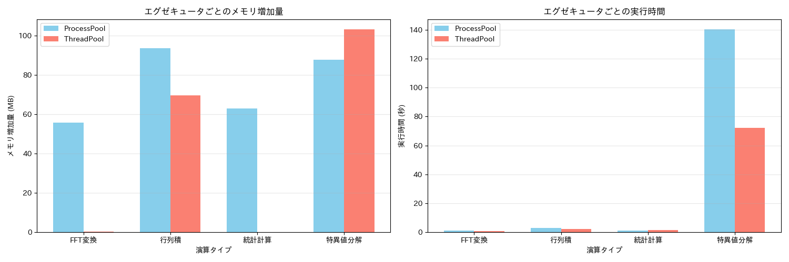

# メモリ効率の詳細比較: ProcessPoolExecutor vs ThreadPoolExecutor

## 実行概要
- ベンチマーク ID: 002_ram
- 実行日時: 2025年03月26日 18:24:33

## システム情報
- CPU: 22コア
- メモリ: 28.7 GB

## テスト設定
- データサイズ: 2000x2000 の行列
- 並列処理ブロック数: 4
- 演算タイプ: 行列積, 特異値分解, FFT変換, 統計計算

## 演算タイプごとの詳細結果

### 行列積

#### 実行時間
- ProcessPoolExecutor: 2.897秒
- ThreadPoolExecutor: 2.091秒
- 速度比 (Process/Thread): 1.39x
- 結論: ThreadPoolExecutorが有利

#### メモリ使用量
- ProcessPoolExecutor 増加量: 93.8 MB
- ThreadPoolExecutor 増加量: 69.7 MB
- メモリ比 (Process/Thread): 1.35x
- 結論: ThreadPoolExecutorが有利

#### タスク実行統計 (ProcessPoolExecutor)
- 平均タスク時間: 0.693秒
- 最大タスク時間: 1.314秒
- 最小タスク時間: 0.228秒

#### タスク実行統計 (ThreadPoolExecutor)
- 平均タスク時間: 1.401秒
- 最大タスク時間: 1.623秒
- 最小タスク時間: 1.223秒

### 特異値分解

#### 実行時間
- ProcessPoolExecutor: 140.379秒
- ThreadPoolExecutor: 72.153秒
- 速度比 (Process/Thread): 1.95x
- 結論: ThreadPoolExecutorが有利

#### メモリ使用量
- ProcessPoolExecutor 増加量: 87.9 MB
- ThreadPoolExecutor 増加量: 103.3 MB
- メモリ比 (Process/Thread): 0.85x
- 結論: ProcessPoolExecutorが有利

#### タスク実行統計 (ProcessPoolExecutor)
- 平均タスク時間: 137.711秒
- 最大タスク時間: 139.728秒
- 最小タスク時間: 136.534秒

#### タスク実行統計 (ThreadPoolExecutor)
- 平均タスク時間: 69.092秒
- 最大タスク時間: 71.818秒
- 最小タスク時間: 66.718秒

### FFT変換

#### 実行時間
- ProcessPoolExecutor: 1.043秒
- ThreadPoolExecutor: 0.596秒
- 速度比 (Process/Thread): 1.75x
- 結論: ThreadPoolExecutorが有利

#### メモリ使用量
- ProcessPoolExecutor 増加量: 55.9 MB
- ThreadPoolExecutor 増加量: 0.3 MB
- メモリ比 (Process/Thread): 185.70x
- 結論: ThreadPoolExecutorが有利

#### タスク実行統計 (ProcessPoolExecutor)
- 平均タスク時間: 0.036秒
- 最大タスク時間: 0.040秒
- 最小タスク時間: 0.033秒

#### タスク実行統計 (ThreadPoolExecutor)
- 平均タスク時間: 0.082秒
- 最大タスク時間: 0.124秒
- 最小タスク時間: 0.039秒

### 統計計算

#### 実行時間
- ProcessPoolExecutor: 1.042秒
- ThreadPoolExecutor: 1.421秒
- 速度比 (Process/Thread): 0.73x
- 結論: ProcessPoolExecutorが有利

#### メモリ使用量
- ProcessPoolExecutor 増加量: 63.0 MB
- ThreadPoolExecutor 増加量: 0.0 MB
- メモリ比 (Process/Thread): 16128.00x
- 結論: ThreadPoolExecutorが有利

#### タスク実行統計 (ProcessPoolExecutor)
- 平均タスク時間: 0.088秒
- 最大タスク時間: 0.099秒
- 最小タスク時間: 0.081秒

#### タスク実行統計 (ThreadPoolExecutor)
- 平均タスク時間: 0.950秒
- 最大タスク時間: 1.056秒
- 最小タスク時間: 0.794秒

## 総合分析

### 実行時間の観点
- ThreadPoolExecutorが有利な演算: 行列積, 特異値分解, FFT変換
- ProcessPoolExecutorが有利な演算: 統計計算

### メモリ効率の観点
- ThreadPoolExecutorがメモリ効率の良い演算: 行列積, FFT変換, 統計計算

## 結論
このベンチマークでは、**ThreadPoolExecutor**がほとんどの演算で実行時間とメモリ効率の両面で優れています。

## 生成されたグラフ

