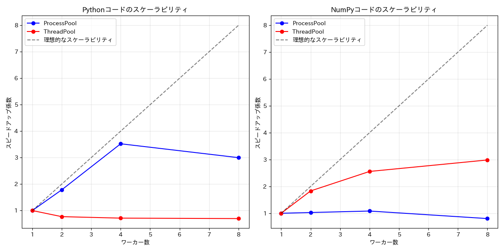

# GILの影響検証: ProcessPoolExecutor vs ThreadPoolExecutor

## 実行概要
- ベンチマーク ID: 003_gil
- 実行日時: 2025年03月26日 18:26:38

## システム情報
- CPU: 22コア
- メモリ: 28.7 GB

## テスト設定
- データサイズ: 1000x1000 の行列
- ワーカー数: 1, 2, 4, 8
- 反復回数: 3
- NumPy比率 (ハイブリッドタスク): 0.00, 0.25, 0.50, 0.75, 1.00

## 1. Python集中型タスク (GIL影響あり)

### ワーカー数による実行時間の比較

| ワーカー数 | ProcessPool (秒) | ThreadPool (秒) | 速度比 (Process/Thread) | 有利なエグゼキュータ |
|----------:|----------------:|--------------:|----------------------:|:---------------------|
| 1 | 7.010 | 6.199 | 1.13x | ThreadPool |
| 2 | 3.931 | 8.055 | 0.49x | ProcessPool |
| 4 | 1.990 | 8.689 | 0.23x | ProcessPool |
| 8 | 2.338 | 8.895 | 0.26x | ProcessPool |

## 2. NumPy最適化タスク (GIL解放)

### ワーカー数による実行時間の比較

| ワーカー数 | ProcessPool (秒) | ThreadPool (秒) | 速度比 (Process/Thread) | 有利なエグゼキュータ |
|----------:|----------------:|--------------:|----------------------:|:---------------------|
| 1 | 0.178 | 0.096 | 1.85x | ThreadPool |
| 2 | 0.173 | 0.053 | 3.30x | ThreadPool |
| 4 | 0.165 | 0.038 | 4.37x | ThreadPool |
| 8 | 0.222 | 0.032 | 6.89x | ThreadPool |

## 3. ハイブリッドタスク (NumPy比率の影響)

### NumPy比率による実行時間の比較 (ワーカー数: 4)

| NumPy比率 | ProcessPool (秒) | ThreadPool (秒) | 速度比 (Process/Thread) | 有利なエグゼキュータ |
|----------:|----------------:|--------------:|----------------------:|:---------------------|
| 0.00 | 1.853 | 9.459 | 0.20x | ProcessPool |
| 0.25 | 2.120 | 7.039 | 0.30x | ProcessPool |
| 0.50 | 1.137 | 4.073 | 0.28x | ProcessPool |
| 0.75 | 0.939 | 2.255 | 0.42x | ProcessPool |
| 1.00 | 0.157 | 0.041 | 3.80x | ThreadPool |

## 総合分析

### 1. Python集中型タスク (GIL影響あり):
- ProcessPool平均時間: 3.817秒
- ThreadPool平均時間: 7.959秒
- Thread/Process 速度比: 0.48x
- 結論: ProcessPoolExecutorが有利

### 2. NumPy最適化タスク (GIL解放):
- ProcessPool平均時間: 0.185秒
- ThreadPool平均時間: 0.055秒
- Process/Thread 速度比: 3.38x
- 結論: ThreadPoolExecutorが有利

### GILの影響に関する考察
1. **Python集中型タスク**: GILの影響を強く受けるPythonコードでは、ThreadPoolExecutorの並列化効果は制限される傾向があります。そのため、ProcessPoolExecutorのほうが有利なケースが多く見られます。

2. **NumPy最適化タスク**: NumPyの多くの演算はGILを解放するため、ThreadPoolExecutorでも並列化の恩恵を受けられます。さらにプロセス間通信のオーバーヘッドがないため、ThreadPoolExecutorが有利になる場合があります。

3. **NumPy比率の影響**: ハイブリッドタスクにおいて、NumPy比率の増加に伴いThreadPoolExecutorの相対的優位性が高まる傾向が見られます。これは、NumPy比率が高いほどGILの制約から解放され、スレッドベースの並列化が効果的になるためです。

### スケーラビリティに関する考察
- Python集中型タスクでは、ThreadPoolExecutorはワーカー数を増やしても性能向上が限られています。これはGILによる制約が原因です。
- NumPy最適化タスクでは、ThreadPoolExecutorはワーカー数の増加に伴って性能が向上する傾向があります。
- ProcessPoolExecutorは両方のタスクタイプでワーカー数の増加による性能向上が見られますが、プロセス生成と通信のオーバーヘッドがあります。

## 結論
このベンチマークから、並列処理戦略を選択する際の一般的なガイドラインとして以下が挙げられます：

1. **CPU集中型のPure Pythonコード**: ProcessPoolExecutorを使用する

2. **NumPy/SciPyなどGILを解放する最適化された演算**: ThreadPoolExecutorを使用する（メモリ効率が良く、オーバーヘッドが少ない）

3. **混合コード**: コードの特性に応じて選択するか、NumPyなどの最適化された演算の比率を増やす工夫をする

GILは並列処理戦略を選ぶ上で重要な要素であり、タスクの特性を理解して適切なエグゼキュータを選択することが性能向上の鍵となります。

## 生成されたグラフ

